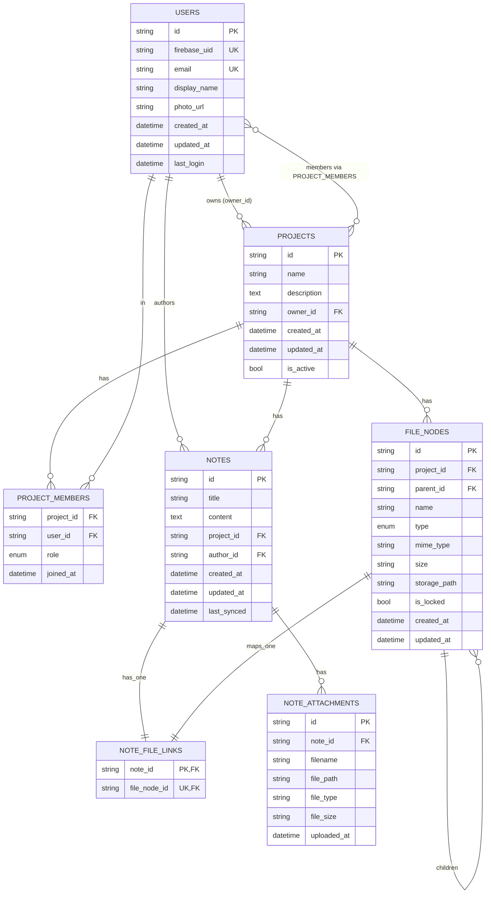
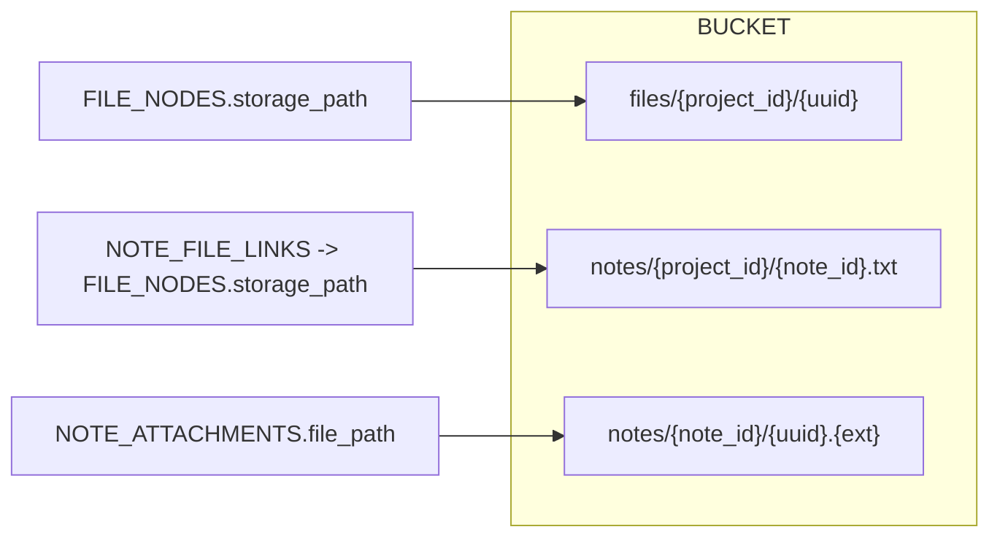

# Data architecture overview

This backend uses:
- PostgreSQL (relational) for users, projects, notes, file tree and links
- MinIO (S3-compatible object storage) for file bytes (uploads, note .txt backing files, attachments)
- Firebase Admin (auth only) to verify ID tokens; user records are mirrored in PostgreSQL via `users.firebase_uid`

Below are visual schemas for both data stores and how they connect.

## PostgreSQL schema (ERD)



Notes:
- `FILE_NODES.parent_id` forms a tree (folders/files). Unique constraint ensures unique sibling names per parent.
- `NOTE_FILE_LINKS` creates a 1:1 mapping between a logical Note and its backing `.txt` file stored as a `FILE_NODE` pointing to MinIO.
- `NOTE_ATTACHMENTS.file_path` also points to MinIO objects.
- `FILE_NODES.type` is one of: folder | file | note.
- `FILE_NODES.storage_path` and `NOTE_ATTACHMENTS.file_path` are MinIO object keys.

## MinIO object structure



Mappings and patterns:
- General uploads: `files/{project_id}/{uuid}` (created via `/files/project/{project_id}/upload`)
- Note backing files: `notes/{project_id}/{note_id}.txt` (created on note creation)
- Note attachments: `notes/{note_id}/{uuid}.{ext}` (images added to a note)

`FILE_NODES.storage_path` and `NOTE_ATTACHMENTS.file_path` are the authoritative pointers to MinIO.

## Firebase (auth)

- Firebase Admin SDK verifies incoming ID tokens.
- The app stores the authenticated user in PostgreSQL `users` with the external identity mapped by `users.firebase_uid`.
- There is no Firestore/Realtime DB used here.

## Table details and indexes

- Unique constraints / indexes of interest:
  - `users.firebase_uid` (unique)
  - `users.email` (unique)
  - `file_nodes`: unique sibling name per parent: `(project_id, parent_id, name)`
  - `file_nodes`: index `(project_id, parent_id)` for folder listings
  - `note_file_links.file_node_id` unique to keep 1:1 mapping

## How this ties to features

- Files tab and gallery operate on `FILE_NODES`. File bytes live in MinIO, referenced by `storage_path`.
- Notes are both rows in `NOTES` and `.txt` files in MinIO; they stay in sync via `NOTE_FILE_LINKS`.
- Note attachments are objects in MinIO referenced by `NOTE_ATTACHMENTS` rows.

```text
PostgreSQL = metadata, relationships, access control
MinIO      = bytes at rest (uploaded files, note text, images)
Firebase   = token verification feeding the Users table
```